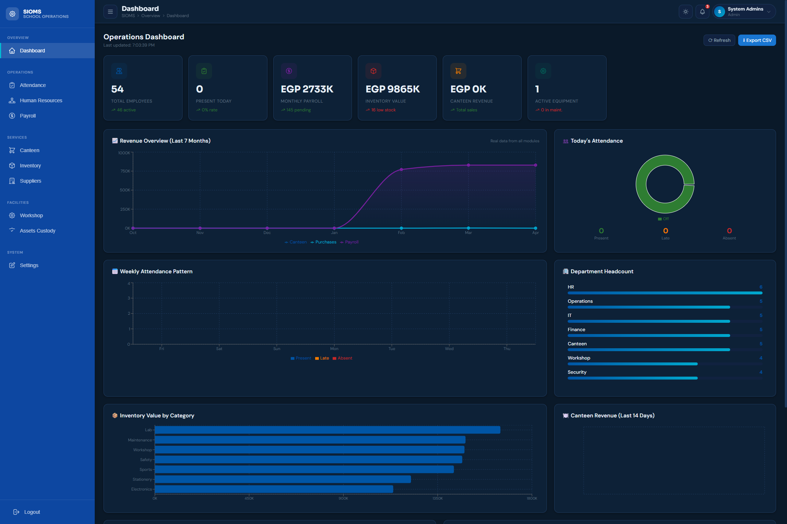
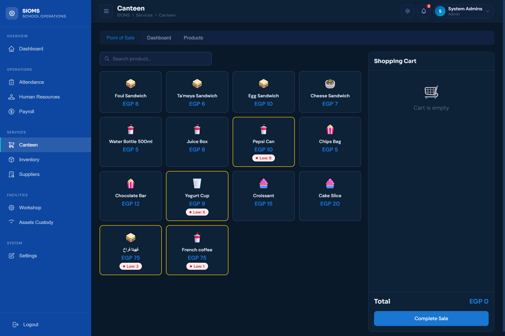

<div align="center">


<br/>

<p align="center">
  
</p>

<br/>

[](#)
[](#)
[](#)
[](#)
[](#)
[](#)

</div>

---

## 🎯 About This Dashboard

> **SIOMS Frontend** is a production-grade enterprise operations dashboard engineered for schools that need institutional-level tooling without institutional-level complexity.

Nine fully operational modules. One coherent interface. Every screen was built to solve a real operational problem — whether that's a Workshop Manager tracking equipment maintenance, an Accountant processing payroll, or a Canteen operator running a live POS terminal.

Built on **Next.js 14 App Router** with strict TypeScript, a hand-crafted CSS variable design system, and **DM Sans + Sora** typography — the UI feels as serious as the operations it manages.

---

## 📸 Screenshots

<div align="center">

| Dashboard Overview | Canteen POS System |
|:---:|:---:|
|  |  |
| *KPIs, revenue chart, attendance donut, activity feed* | *Full POS system with cart, products & hourly chart* |

> 📌 Create a `screenshots/` folder in the repo root and drop your images in — the table renders automatically on GitHub.

</div>

---

## ✨ Module Breakdown

### 📊 Dashboard
The command center. Real-time KPI cards pulling live aggregates across all modules, a revenue time-series chart, an attendance donut, and a live activity feed showing the latest operations across the institution.

### 🕐 Attendance
Daily attendance register with date-range filtering, status badges (Present / Absent / Late), and a visual chart breakdown. Supports manual check-in/out operations with instant UI feedback.

### 👥 HR
Full employee directory with search, department filtering, and paginated records. Leave request management and penalty tracking with status workflows built into the same view.

### 💰 Payroll
Salary breakdown table per department and month. Payslip modal with full component breakdown (base, bonuses, deductions). Single-click mark-as-paid and bulk pay-all for month-end runs. Export-ready.

### 🍽️ Canteen
The most complex module — a complete **Point of Sale system** embedded directly in the dashboard. Product catalog management, cart with quantity controls, live subtotal calculation, and an hourly revenue chart. Every transaction is logged to the backend.

### 📦 Inventory
200+ item catalog with category filtering, free-text search, and automatic low-stock alerts. Quantity adjustment operations (add / subtract / set) with instant DB sync.

### 🏭 Suppliers
Vendor directory with category and status filters, star ratings, and purchase order history. Full CRUD with a clean modal-driven creation flow.

### 🔧 Workshop
Equipment registry with status tracking (Operational / Under Maintenance / Decommissioned). Inline maintenance log creation and a full maintenance history timeline per machine.

### 🏷️ Assets
Institutional asset custody tracker. Maps each asset to an employee, tracks assignment history, and supports return processing with a full timeline view.

---

## 🎨 Design System

All tokens live in `src/styles/globals.css` as CSS custom properties. Dark mode is applied by toggling `.dark` on `<html>` — no library needed.

### Color Tokens

| Token | Light | Dark | Role |
|-------|-------|------|------|
| `--primary` | `#0f3460` | `#e94560` | Brand — actions & nav |
| `--accent` | `#e94560` | `#e94560` | Alerts & CTAs |
| `--bg` | `#f0f4f8` | `#050510` | Page background |
| `--surface` | `#ffffff` | `#0a0a2e` | Card surfaces |
| `--surface2` | `#f8fafc` | `#0f1535` | Elevated layers |
| `--success` | `#10b981` | `#10b981` | Positive states |
| `--warning` | `#f59e0b` | `#f59e0b` | Caution states |
| `--danger` | `#ef4444` | `#ef4444` | Destructive actions |

### Typography

| Use | Font | Weight |
|-----|------|--------|
| Display & Headings | `Sora` | 600 / 700 |
| Body & UI | `DM Sans` | 400 / 500 |

---

## 🏗️ Project Structure

```
sioms-frontend/
│
├── 📁 src/
│   ├── 📁 app/
│   │   ├── layout.tsx              # Root layout — metadata + global CSS injection
│   │   └── page.tsx                # Entry point → mounts AppShell
│   │
│   ├── 📁 components/
│   │   ├── AppShell.tsx            # Master controller — auth state, routing, dark mode
│   │   │
│   │   ├── 📁 layout/
│   │   │   ├── Sidebar.tsx         # Fixed navigation sidebar with role-filtered groups
│   │   │   └── Navbar.tsx          # Top bar — breadcrumb, notifications, profile
│   │   │
│   │   ├── 📁 modules/             # Full-page feature modules (one per domain)
│   │   │   ├── LoginPage.tsx
│   │   │   ├── Dashboard.tsx
│   │   │   ├── Attendance.tsx
│   │   │   ├── HR.tsx
│   │   │   ├── Payroll.tsx
│   │   │   ├── Canteen.tsx         # Includes complete POS system
│   │   │   ├── Inventory.tsx
│   │   │   ├── Suppliers.tsx
│   │   │   ├── Workshop.tsx
│   │   │   └── Assets.tsx
│   │   │
│   │   └── 📁 ui/
│   │       ├── Icon.tsx            # SVG icon library (30+ icons)
│   │       └── index.tsx           # Badge, SearchBar, Pagination, Modal, KPICard, Tabs
│   │
│   ├── 📁 data/
│   │   └── mockData.ts             # Seed data for all modules
│   │
│   ├── 📁 lib/
│   │   └── toast.tsx               # Toast notification system (Context + Provider)
│   │
│   ├── 📁 styles/
│   │   └── globals.css             # Complete design system — tokens, dark mode, resets
│   │
│   └── 📁 types/
│       └── index.ts                # TypeScript interfaces for all entities
│
├── next.config.js
├── tsconfig.json
└── package.json
```

---

## 🚀 Quick Start

### Prerequisites

| Tool | Min Version |
|------|-------------|
| Node.js | `v18+` |
| npm | `v9+` |
| SIOMS Backend | Running on `localhost:5000` |

```bash
# Step 1 — Enter the portal
cd sioms-frontend

# Step 2 — Install dependencies
npm install

# Step 3 — Configure environment
# Create .env.local and add:
NEXT_PUBLIC_API_URL=http://localhost:5000/api

# Step 4 — Launch 🚀
npm run dev
```

> Dashboard opens at **`http://localhost:3000`**

---

## 🔑 Demo Credentials

Use **any email** with password `admin123` and select your role:

| Role | Email (example) | Password | Access Scope |
|------|----------------|----------|-------------|
| 👑 Admin | `admin@school.edu.eg` | `admin123` | All modules |
| 🧑‍💼 HR Manager | `hr@school.edu.eg` | `admin123` | HR, Attendance, Payroll, Assets |
| 💳 Accountant | `finance@school.edu.eg` | `admin123` | Payroll, Canteen, Suppliers |
| 🔧 Workshop Manager | `workshop@school.edu.eg` | `admin123` | Workshop, Assets, Inventory |
| 📦 Inventory Manager | `inventory@school.edu.eg` | `admin123` | Inventory, Suppliers |
| 📚 Teacher | `teacher@school.edu.eg` | `admin123` | Attendance, Workshop |
| 🧑‍🏫 Staff | `staff@school.edu.eg` | `admin123` | Attendance only |

---

## 🧩 Adding a New Module

```
1. Create     src/components/modules/YourModule.tsx
2. Register   src/components/layout/Sidebar.tsx  →  NAV_ITEMS array
3. Map        src/components/AppShell.tsx         →  PAGE_MAP object
4. Type       src/types/index.ts                  →  Add entity interfaces
5. Seed       src/data/mockData.ts                →  Add mock records
```

---

## 🧪 Dev Commands

```bash
npm run dev      # Start Next.js dev server at localhost:3000
npm run build    # Production build with full optimization
npm run start    # Serve production build
npm run lint     # ESLint + TypeScript strict check
```

---

<div align="center">

**SIOMS Frontend** — *Every module purpose-built. Every pixel intentional.*


</div>
